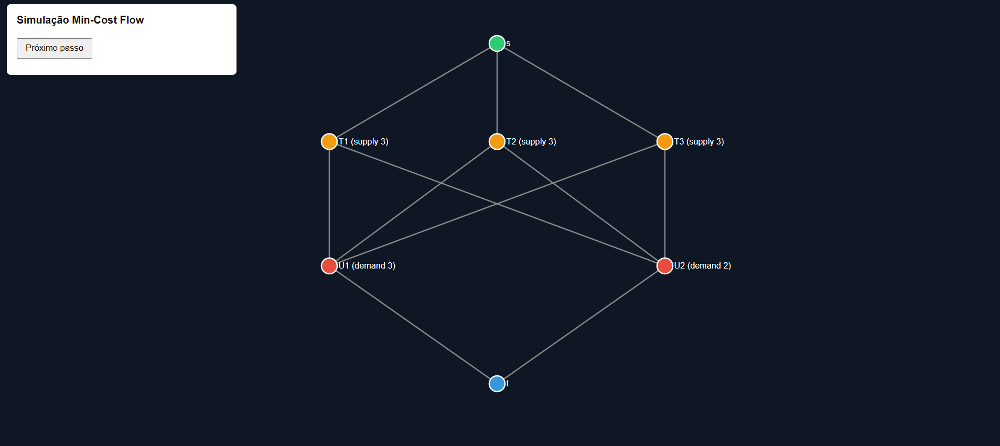

## **Modelagem do Problema como Fluxo em Grafo Bipartido**

O problema é modelado como um **grafo bipartido** onde os nós representam dois conjuntos distintos:

* **Rastreadores (Trackers)** – possuem recursos disponíveis (*supply*).  
* **UPS** – possuem demanda de recursos (*demand*).

Para facilitar o cálculo do fluxo, adicionamos dois nós auxiliares:

* **`s` (source)** – origem do fluxo.  
* **`t` (sink)** – destino final do fluxo.

A estrutura do grafo é:

s → rastreadores → UPS → t

### **Capacidades**

As capacidades das arestas representam as restrições do problema:

* `s → rastreador`  
  capacidade \= recurso disponível no rastreador.  
* `rastreador → UPS`  
  representa uma possível conexão entre eles, podendo ter um custo associado (ex: distância).  
* `UPS → t`  
  capacidade \= **demanda da UPS**.

### **Execução do Algoritmo**

O fluxo é calculado iterativamente utilizando a ideia do algoritmo **Successive Shortest Path** para resolver um problema de **Minimum Cost Flow**:

1. Encontrar o **menor caminho** de `s` até `t`.  
2. Enviar o **máximo fluxo possível** por esse caminho.  
3. Reduzir a demanda da UPS atendida.  
4. Repetir o processo até que todas as demandas sejam satisfeitas.

### **Resultado**

Ao final, o algoritmo determina **quais rastreadores devem fornecer recursos para cada UPS**, garantindo que:

* todas as demandas sejam atendidas;  
* o custo total (ex: distância ou energia) seja mínimo.

### Visualização com D3.js

A visualização do grafo foi construída utilizando D3.js, uma biblioteca JavaScript para manipulação de documentos baseada em dados.

No projeto, o D3 é utilizado para:

Renderizar os nós do grafo (s, rastreadores, UPS e t) como elementos SVG.

Desenhar as arestas entre os nós representando as conexões do fluxo.

Posicionar os nós em camadas que refletem a estrutura bipartida do problema (s → rastreadores → UPS → t).

Animar o fluxo ao longo das arestas, destacando os caminhos encontrados pelo algoritmo.

A cada iteração do algoritmo:

- O caminho mínimo encontrado é destacado visualmente.

- Um marcador animado percorre as arestas do caminho.

- O fluxo enviado representa o atendimento da demanda de uma UPS.

Essa visualização permite observar de forma intuitiva como o algoritmo distribui os recursos dos rastreadores para as UPS até que todas as demandas sejam satisfeitas.

### Autores
- BRUNO KADAYAN
- ANTONIO ANDRE
